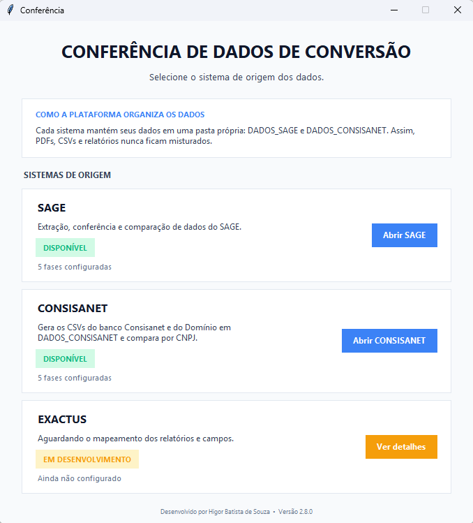
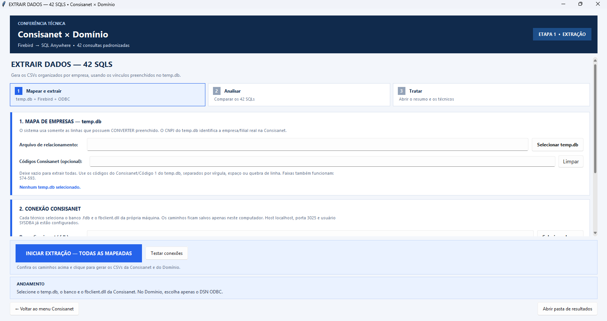
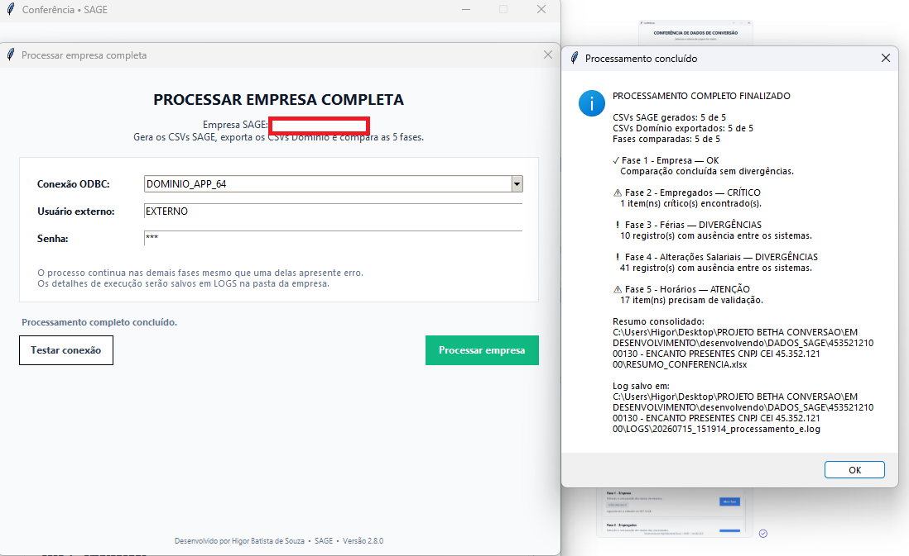
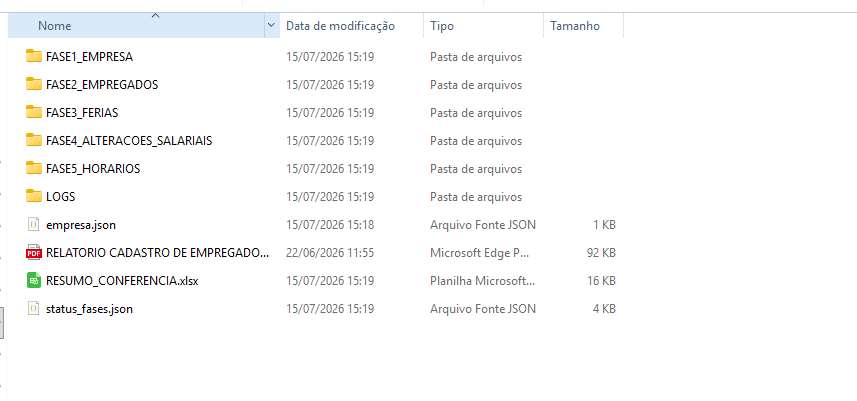

# Sistema de Conferência de Conversão de Dados

Sistema desenvolvido em **Python** para automatizar a conferência de dados em processos de conversão entre sistemas de folha de pagamento.

A aplicação realiza a extração, comparação e validação de informações entre diferentes bases de dados, identificando divergências e gerando relatórios técnicos que auxiliam equipes durante projetos de migração de sistemas.

> **🔒 Código-fonte**
>
> Este repositório tem como objetivo apresentar o projeto desenvolvido. O código-fonte completo não é disponibilizado publicamente por conter integrações, consultas SQL e regras de negócio desenvolvidas para ambiente corporativo.

---

# Interface da Aplicação

## Menu Principal



Tela inicial da aplicação responsável por centralizar todas as funcionalidades do sistema.

---

## Extração de Dados



Nesta etapa o sistema realiza:

- Seleção das empresas
- Conexão com os bancos de dados
- Execução das consultas SQL
- Geração automática dos arquivos necessários para conferência

---

## Processamento



O processamento executa automaticamente todas as fases da conferência, apresentando ao usuário um resumo completo da execução.

Entre as verificações realizadas:

- Empresas
- Empregados
- Férias
- Alterações Salariais
- Horários
- eSocial
- Responsáveis Legais
- Demais cadastros utilizados durante a conversão

---

## Estrutura dos Resultados



Após o processamento, todos os arquivos são organizados automaticamente em uma estrutura padronizada contendo:

- Relatórios
- Logs
- Arquivos auxiliares
- Resumos da conferência

---

# Principais Funcionalidades

- Comparação automática entre sistemas
- Extração de dados diretamente dos bancos
- Identificação de divergências
- Consolidação dos resultados
- Geração de relatórios em Excel
- Organização automática dos arquivos
- Interface gráfica para utilização pelos técnicos
- Suporte a múltiplas etapas da conferência

---

# Tecnologias Utilizadas

- Python
- SQL
- Firebird
- SQL Anywhere (Sybase)
- Pandas
- OpenPyXL
- Tkinter
- Git
- GitHub

---

# Fluxo do Sistema

```text
Banco de Dados
      │
      ▼
Extração
      │
      ▼
Tratamento
      │
      ▼
Comparação
      │
      ▼
Relatórios
      │
      ▼
Resumo Final
```

---

# Objetivo

Automatizar processos de conferência de dados durante conversões entre sistemas de folha de pagamento, reduzindo atividades manuais, aumentando a produtividade e fornecendo maior confiabilidade aos resultados obtidos.

---

# Diferenciais

✔ Interface gráfica intuitiva

✔ Processamento automatizado

✔ Organização automática dos resultados

✔ Geração de relatórios técnicos

✔ Estrutura modular

✔ Aplicação desenvolvida para ambiente corporativo

---

# Observações

Por questões de confidencialidade, este repositório **não contém**:

- Código-fonte completo
- Consultas SQL utilizadas em produção
- Bases de dados
- Informações de clientes
- Regras de negócio específicas

O objetivo é apresentar a arquitetura da solução, sua interface e os resultados obtidos durante o desenvolvimento.

---

# Autor

## Higor Batista de Souza

**Analista de Sistemas • Desenvolvedor Python • SQL • Automação de Processos**

GitHub: https://github.com/HigorSouzaBatista

LinkedIn: https://www.linkedin.com/in/higorsouza-analistadedados/